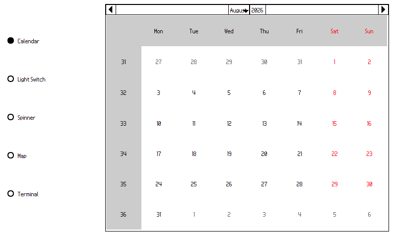
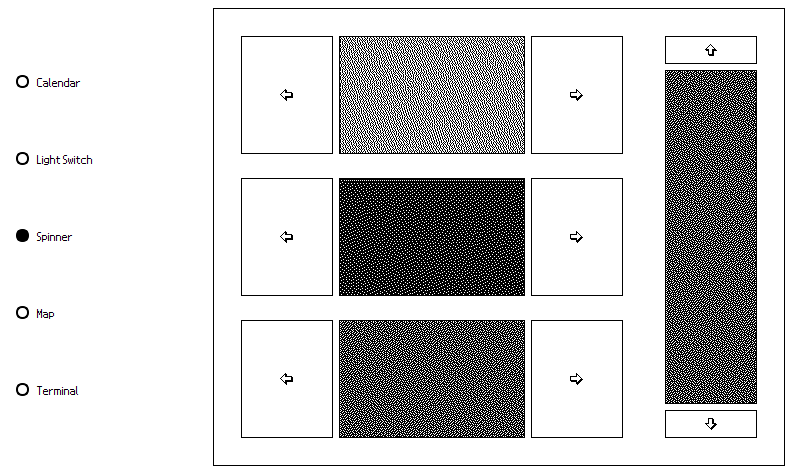
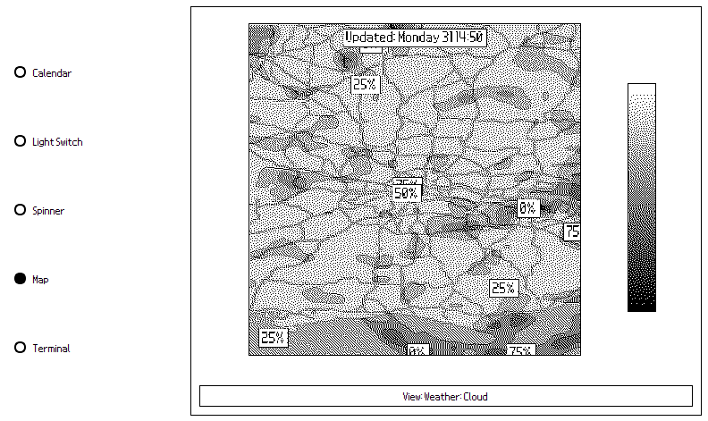
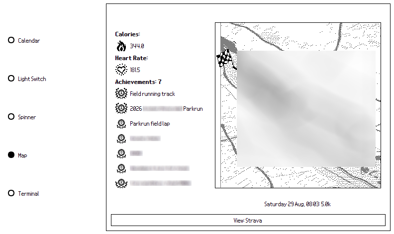
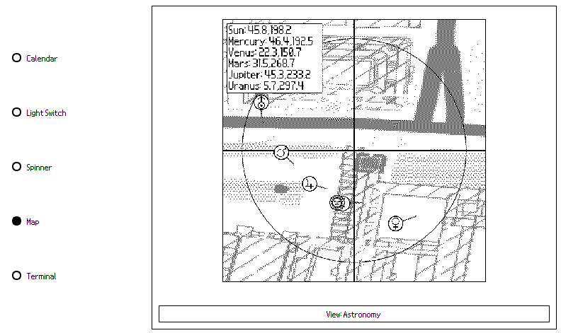

# WallDisplay for Home Assistant

<table>
    <tr>
        <td></td>
        <td></td>
    </tr>
</table>
<table>
    <tr>
        <td></td>
        <td></td>
        <td></td>
    </tr>
</table>

---

**WallDisplay** is a 1-bit wall display GUI designed with e-ink displays in mind. Primarily, the architecture is built to interface with Home Assistant, as well as public data APIs like weather and maps, Strava, etc.

Several modules have been developed that attempt to convey the information from these endpoints, particularly HASS data, into something that is usable, but also looks nice, on a display restricted to B&W/greyscale. For example, the `Spinners` pane is a test to convey RGB & brightness values to the user for controlling smart bulbs.

The app is primarily built and modified from the modules in `modules/app_core.py`. A `tokens.json` file is needed to store your secrets and config - an example of this is provided.

---

I hope you enjoy the progress on this! Speaking personally, this idea came about because I really loved how the Nintendo DS home screen looked and felt to interact with. I wanted to produce a platform that was somewhat similar with room for growth and creativity.

~ Andi